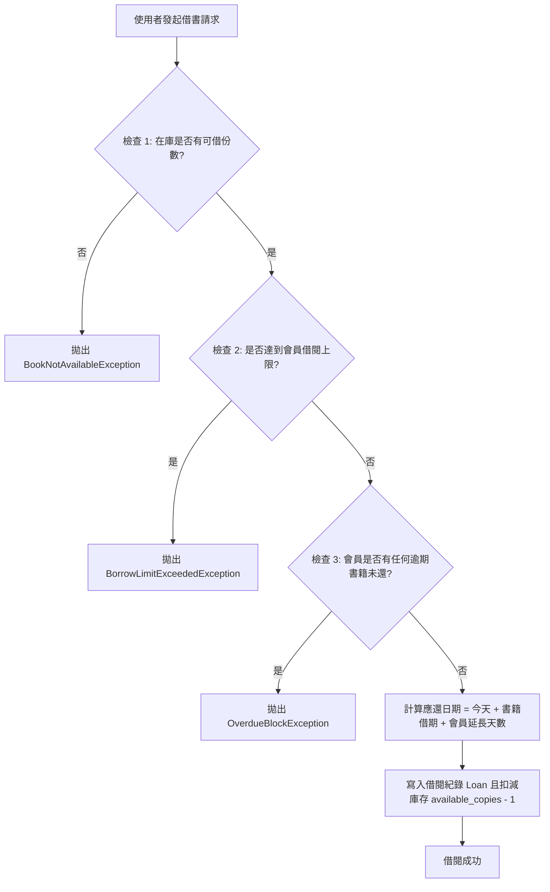
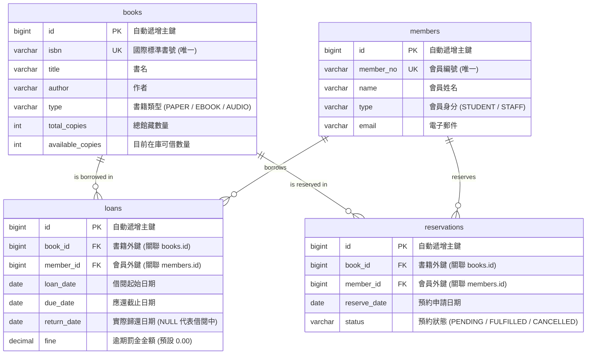

# 📚 圖書館借閱與預約管理系統 (Library Management System)

> 一款基於 **Java 17+** 與 **MySQL** 開發的高可靠度命令列（CLI）圖書館管理系統。採用分層架構（Layered Architecture）與物件導向設計原則，實現藏書管理、會員權限、借還書檢驗、智慧續借、預約排隊與多維度統計報表。

---

## 📑 目錄

- [系統特色與技術亮點](#-系統特色與技術亮點)
- [技術堆疊 (Tech Stack)](#-技術堆疊-tech-stack)
- [系統架構與設計模式](#-系統架構與設計模式)
- [核心業務規則矩陣](#-核心業務規則矩陣)
  - [1. 書籍類型規則](#1-書籍類型規則)
  - [2. 會員身分權限](#2-會員身分權限)
  - [3. 借閱、歸還、續借與預約機制](#3-借閱歸還續借與預約機制)
- [資料庫設計 (Database Schema)](#-資料庫設計-database-schema)
- [快速開始 (Quick Start)](#-快速開始-quick-start)
  - [環境需求](#環境需求)
  - [1. 資料庫初始化](#1-資料庫初始化)
  - [2. 設定檔配置](#2-設定檔配置)
  - [3. 編譯與執行](#3-編譯與執行)
- [系統選單操作指南](#-系統選單操作指南)
- [專案結構 (Directory Structure)](#-專案結構-directory-structure)
- [軟體工程實踐與安全性](#-軟體工程實踐與安全性)
- [轉職心得與謝詞](#-轉職心得與謝詞)

---

## 🌟 系統特色與技術亮點

- **分層架構設計 (Layered Architecture)**：嚴格切分 UI 表達層、Service 業務邏輯層、DAO 資料存取層與 Model 領域模型層，各層職責分明且具備高度擴充性。
- **領域模型與多型列舉 (Rich Domain Enums)**：將借期、費率、借閱上限等業務規則直接封裝於 `BookType` 與 `MemberType` 列舉中，大幅消除條件分支（Clean Code）。
- **不可變資料載體 (Modern Java Records)**：報表與交易結果採用 Java 17 `record` 宣告，確保資料傳遞時具備執行緒安全與不可變性（Immutability）。
- **嚴謹的例外處理機制 (Robust Exception Hierarchy)**：建立以 `LibraryException` 為基底的自訂未受檢例外體系（Unchecked Exceptions），於 Service 層主動防禦、UI 層統一攔截與回饋。
- **全方位防禦性程式設計 (Defensive Design)**：
  - SQL 語句 100% 採用 `PreparedStatement` 參數化查詢，杜絕 SQL Injection 風險。
  - 全面導入 `try-with-resources` 語法，確保資料庫連線、敘述句與結果集自動關閉，杜絕連線外洩（Connection Leak）。
  - 自建 `InputHandler` 統一字串修剪與輸入防呆，徹底避免標準輸入流換行符號殘留問題。

---

## 🛠 技術堆疊 (Tech Stack)

| 類別 | 技術 / 工具 | 說明 |
| :--- | :--- | :--- |
| **開發語言** | Java 17 (LTS) | 運用 Text Blocks、Records、Switch Expressions、Optional API |
| **持久層技術** | JDBC (Java Database Connectivity) | 原生 PreparedStatement、動態條件組合查詢 |
| **資料庫** | MySQL 8.0+ | 支援交易邏輯、日期運算（`DATEDIFF`、`CURDATE()`）與關聯約束 |
| **驅動程式** | MySQL Connector/J 9.7.0 | 資料庫通訊驅動程式（置於 `/lib`） |
| **架構模式** | 3-Tier Layered Architecture | UI ➔ Service ➔ DAO ➔ Database |
| **設計原則** | OOP / SOLID / DRY / Fail-Fast | 依賴注入、職責單一化、防禦性驗證 |

---

## 🏗 系統架構與設計模式

### 系統分層架構圖

```
┌─────────────────────────────────────────────────────────────┐
│                    Presentation Layer (UI)                  │
│       AppMain │ BookMenu │ MemberMenu │ LoanMenu │ ReportMenu│
│                        InputHandler                         │
└──────────────────────────────┬──────────────────────────────┘
                               │ (Calls Services / DTOs)
                               ▼
┌─────────────────────────────────────────────────────────────┐
│                    Business Logic Layer                     │
│               BookService │ MemberService │ LoanService      │
│   (BorrowResult, ReturnResult, RenewResult, ReservationResult)│
└──────────────────────────────┬──────────────────────────────┘
                               │ (Invokes DAOs / Models)
                               ▼
┌─────────────────────────────────────────────────────────────┐
│                    Data Access Layer (DAO)                  │
│       DBUtil │ BookDAO │ MemberDAO │ LoanDAO │ ReservationDAO│
└──────────────────────────────┬──────────────────────────────┘
                               │ (JDBC / SQL Driver)
                               ▼
┌─────────────────────────────────────────────────────────────┐
│                    Database Storage                         │
│                         MySQL                               │
└─────────────────────────────────────────────────────────────┘
```

### 設計模式與設計哲學

1. **DAO 模式 (Data Access Object Pattern)**：隔離底層 SQL 存取細節，提供簡潔的物件導向 CRUD 介面。
2. **依賴注入 (Constructor Dependency Injection)**：由 `AppMain` 統一組裝 DAO 並注入 Service，降低模組耦合度，利於單元測試。
3. **多型策略列舉 (Strategy Pattern via Enum)**：透過 `BookType` 與 `MemberType` 將業務常數與行為封裝，取代易出錯的 `switch-case` 判定。
4. **快速失敗 (Fail-Fast Validation)**：在執行核心狀態變更前，先經由 Guard Clauses 驗證所有前置條件，不滿足立即拋出業務例外。

---

## 📊 核心業務規則矩陣

### 1. 書籍類型規則

| 書籍類型 (`BookType`) | 預設借期 | 逾期罰金 (元/天) | 份數限制機制 | 特殊業務說明 |
| :--- | :---: | :---: | :---: | :--- |
| **紙本書 (`PAPER`)** | 14 天 | 5 元 | 有限制 (`available_copies`) | 借出扣減份數、歸還回補份數 |
| **電子書 (`EBOOK`)** | 7 天 | 0 元 (無罰金) | 不限份數 (`isCopyLimited=false`) | 可多人同時借閱，無在庫上限 |
| **有聲書 (`AUDIO`)** | 10 天 | 3 元 | 有限制 (`available_copies`) | 借出扣減份數、歸還回補份數 |

### 2. 會員身分權限

| 會員身分 (`MemberType`) | 同時借閱上限 | 借期延長優惠 | 說明 |
| :--- | :---: | :---: | :--- |
| **學生 (`STUDENT`)** | 3 本 | 0 天 | 借期為書籍之基本借期 |
| **教職員 (`STAFF`)** | 10 本 | +7 天 | 借期為「書籍基本借期 + 7 天」 |

---

### 3. 借閱、歸還、續借與預約機制



- **借書（三道檢查防線）**：
  1. **庫存檢查**：檢查在庫可用份數 `available_copies > 0`（電子書豁免）。
  2. **額度檢查**：檢查會員進行中的借閱總數未超過 `borrowLimit`。
  3. **信用檢查**：檢查會員無任何借閱逾期（`hasOverdue == false`）。
- **還書與結算**：
  - 根據實際歸還日比對應還期限，計算逾期天數。
  - 結算罰金：$\text{罰金} = \text{逾期天數} \times \text{書籍每日費率}$。
  - 關閉借閱單並安全回補館藏份數。
- **智慧續借（Renew）**：
  - 僅限借閱中且**尚未逾期**之書籍。
  - **期限防呆**：僅允許在**到期日前 3 天內**辦理續借。
  - **預約保護**：若該書籍已被其他讀者預約（`PENDING`），則**禁止續借**以保障預約者權益。
- **預約排隊（Reserve）**：
  - 僅限所有在架份數已被借出之書籍（在庫尚有可借書籍時引導直接借閱）。
  - 有逾期紀錄、目前正持有該書或已在預約佇列中的會員禁止重複預約。

---

## 🗄 資料庫設計 (Database Schema)

### 實體關聯圖 (ER Diagram)



### 資料庫建立 SQL 腳本 (DDL & Sample Data)

可直接在 MySQL 用戶端執行以下腳本完成資料庫與範例資料建置：

```sql
-- 1. 建立資料庫
CREATE DATABASE IF NOT EXISTS library_db
  CHARACTER SET utf8mb4
  COLLATE utf8mb4_unicode_ci;

USE library_db;

-- 2. 建立書籍資料表
CREATE TABLE IF NOT EXISTS books (
    id BIGINT AUTO_INCREMENT PRIMARY KEY,
    isbn VARCHAR(50) NOT NULL UNIQUE,
    title VARCHAR(255) NOT NULL,
    author VARCHAR(255) NOT NULL,
    type VARCHAR(20) NOT NULL,
    total_copies INT NOT NULL DEFAULT 1,
    available_copies INT NOT NULL DEFAULT 1,
    INDEX idx_books_title (title),
    INDEX idx_books_type (type)
) ENGINE=InnoDB;

-- 3. 建立會員資料表
CREATE TABLE IF NOT EXISTS members (
    id BIGINT AUTO_INCREMENT PRIMARY KEY,
    member_no VARCHAR(50) NOT NULL UNIQUE,
    name VARCHAR(100) NOT NULL,
    type VARCHAR(20) NOT NULL,
    email VARCHAR(255),
    INDEX idx_members_no (member_no)
) ENGINE=InnoDB;

-- 4. 建立借閱紀錄表
CREATE TABLE IF NOT EXISTS loans (
    id BIGINT AUTO_INCREMENT PRIMARY KEY,
    book_id BIGINT NOT NULL,
    member_id BIGINT NOT NULL,
    loan_date DATE NOT NULL,
    due_date DATE NOT NULL,
    return_date DATE NULL,
    fine DECIMAL(10, 2) NOT NULL DEFAULT 0.00,
    CONSTRAINT fk_loans_book FOREIGN KEY (book_id) REFERENCES books (id) ON DELETE RESTRICT,
    CONSTRAINT fk_loans_member FOREIGN KEY (member_id) REFERENCES members (id) ON DELETE RESTRICT,
    INDEX idx_loans_active (member_id, return_date),
    INDEX idx_loans_due (due_date)
) ENGINE=InnoDB;

-- 5. 建立預約紀錄表
CREATE TABLE IF NOT EXISTS reservations (
    id BIGINT AUTO_INCREMENT PRIMARY KEY,
    book_id BIGINT NOT NULL,
    member_id BIGINT NOT NULL,
    reserve_date DATE NOT NULL,
    status VARCHAR(20) NOT NULL DEFAULT 'PENDING',
    CONSTRAINT fk_reservations_book FOREIGN KEY (book_id) REFERENCES books (id) ON DELETE RESTRICT,
    CONSTRAINT fk_reservations_member FOREIGN KEY (member_id) REFERENCES members (id) ON DELETE RESTRICT,
    INDEX idx_reservations_book_status (book_id, status)
) ENGINE=InnoDB;

-- 6. 插入基礎測試資料 (可選)
INSERT INTO books (isbn, title, author, type, total_copies, available_copies) VALUES
('9789861371955', '被討厭的勇氣', '岸見一郎', 'PAPER', 3, 3),
('9789863475859', 'Clean Code 敏捷軟體開發實戰', 'Robert C. Martin', 'PAPER', 2, 2),
('9789864344567', 'Java 核心技術卷 I', 'Cay S. Horstmann', 'EBOOK', 1, 1),
('9789865021234', '原子習慣（有聲書）', 'James Clear', 'AUDIO', 2, 2);

INSERT INTO members (member_no, name, type, email) VALUES
('M001', '王小明', 'STUDENT', 'ming@example.com'),
('M002', '李老師', 'STAFF', 'lee_teacher@school.edu.tw'),
('M003', '張美玲', 'STUDENT', 'meiling@example.com');
```

---

## 🚀 快速開始 (Quick Start)

### 環境需求

- **JDK**: Java Development Kit 17 或更新版本
- **Database**: MySQL 8.0+
- **IDE**: VS Code / IntelliJ IDEA / Eclipse 或純終端機環境

---

### 1. 資料庫初始化

啟動 MySQL 伺服器並執行上述 [資料庫建立 SQL 腳本](#資料庫建立-sql-腳本-ddl--sample-data) 建立 `library_db`。

---

### 2. 設定檔配置

請於 `src/` 目錄下確認或建立 `db.properties`（該檔案已被加入 `.gitignore` 以確保連線機密安全）：

```properties
# src/db.properties
db.url=jdbc:mysql://localhost:3306/library_db?useSSL=false&serverTimezone=Asia/Taipei&characterEncoding=utf8&allowPublicKeyRetrieval=true
db.user=root
db.password=YOUR_MYSQL_PASSWORD
```

> 💡 若未提供設定檔，`DBUtil` 將自動啟動安全防呆機制，套用內建預設值進行連線。

---

### 3. 編譯與執行

#### 方法一：終端機指令（PowerShell / Command Prompt）

```powershell
# 1. 確保位於專案根目錄
cd library-management

# 2. 建立編譯輸出目錄 (若尚未存在)
if (!(Test-Path "bin")) { New-Item -ItemType Directory -Path "bin" }

# 3. 編譯所有 Java 原始碼 (關聯 lib 下的 MySQL 驅動)
javac -encoding UTF-8 -cp "lib/*" -d bin (Get-ChildItem -Recurse -Filter *.java src | ForEach-Object { $_.FullName })

# 4. 將設定檔複製到 class 執行目錄
Copy-Item "src/db.properties" -Destination "bin/"

# 5. 啟動主程式
java -cp "bin;lib/*" com.library.ui.AppMain
```

#### 方法二：VS Code / IDE 執行

1. 用 VS Code 開啟 `library-management` 資料夾。
2. 確保已安裝 Extension Pack for Java。
3. 開啟 `src/com/library/ui/AppMain.java`，點擊 `Run` 或按下 `F5` 即可啟動。

---

## 💻 系統選單操作指南

```
════════ 圖書館借閱管理系統 ════════

──────── 主選單 ────────
 1. 藏書管理
 2. 會員管理
 3. 借閱管理
 4. 報表
 0. 離開
```

### 1. 藏書管理 (Book Management)
- **新增藏書**：錄入 ISBN、書名、作者、類型（紙本/電子/有聲）及館藏份數，自動防範 ISBN 重複。
- **依 ISBN 查詢**：快速檢視書籍目前可借數量與基本資料。
- **藏書列表**：列出全館所有藏書與在庫庫存狀態。
- **組合條件查詢**：支援書名關鍵字、作者關鍵字與書籍類型的任意交集模糊查詢。

### 2. 會員管理 (Member Management)
- **新增會員**：建立學生或教職員帳號，自動指派借書額度上限與借期寬限。
- **依會員編號查詢**：即時調閱會員個人資料與權限。
- **會員列表**：瀏覽目前系統註冊的所有讀者清單。

### 3. 借閱與預約管理 (Loan & Reservation Management)
- **借書**：輸入書籍 ID 與會員 ID，即時通過三道檢驗並印出應還日期。
- **還書**：輸入借閱單 ID，自動計算是否逾期、天數及罰金，並即刻回補在架庫存。
- **續借**：支援到期前 3 天內的借期延長，並自動進行他人預約衝突檢查。
- **預約**：當心儀書籍無在庫庫存時進行預約排隊登記。
- **取消預約**：隨時釋放有效預約紀錄。
- **未歸還清單 / 預約清單**：直觀掌握全館借調與預約全貌。

### 4. 統計報表 (Analytics & Reports)
- **逾期借閱清單**：列出所有超期未還紀錄，並依照逾期天數由長至短排序。
- **會員借閱排行**：統計借閱頻次最高的 Top 10 熱門讀者排行榜。

---

## 📁 專案結構 (Directory Structure)

```text
library-management/
├── .gitignore                      # Git 忽略設定檔 (排除敏感帳密與編譯產物)
├── README.md                       # 專業專案技術說明文件
├── lib/
│   └── mysql-connector-j-9.7.0.jar # MySQL 官方 JDBC 驅動套件
└── src/
    ├── db.properties               # 資料庫連線配置檔 (機密資料)
    └── com/
        └── library/
            ├── dao/                # 【資料存取層】
            │   ├── DBUtil.java         # JDBC 連線管理與靜態資源載入工具
            │   ├── BookDAO.java        # 藏書 CRUD 與庫存原子增減操作
            │   ├── MemberDAO.java      # 會員 CRUD 操作
            │   ├── LoanDAO.java        # 借閱紀錄維護與多表 JOIN 報表統計
            │   └── ReservationDAO.java # 預約紀錄與排隊狀態維護
            ├── model/              # 【領域模型層】
            │   ├── Book.java           # 藏書實體
            │   ├── BookType.java       # 書籍類型列舉（含借期、罰金與限額策略）
            │   ├── Member.java         # 會員實體
            │   ├── MemberType.java     # 會員身分列舉（含借閱上限與加成借期）
            │   ├── Loan.java           # 借閱紀錄實體（含逾期計算邏輯）
            │   ├── Reservation.java    # 預約紀錄實體
            │   ├── ReservationStatus.java # 預約狀態列舉
            │   ├── ActiveLoanDetail.java  # 未歸還詳細資料 (Record DTO)
            │   ├── ReservationDetail.java # 預約詳細資料 (Record DTO)
            │   ├── OverdueReportRow.java  # 逾期報表列 (Record DTO)
            │   └── MemberRankingRow.java  # 借閱排行報表列 (Record DTO)
            ├── service/            # 【業務邏輯層】
            │   ├── BookService.java    # 藏書驗證與業務邏輯
            │   ├── MemberService.java  # 會員驗證與業務邏輯
            │   ├── LoanService.java    # 借還書檢查、罰金結算、續借與預約排程
            │   ├── BorrowResult.java   # 借書結果封裝 (Record)
            │   ├── ReturnResult.java   # 還書與結算結果封裝 (Record)
            │   ├── RenewResult.java    # 續借結果封裝 (Record)
            │   └── ReservationResult.java # 預約結果封裝 (Record)
            ├── exception/          # 【自訂異常體系】
            │   ├── LibraryException.java           # 業務異常基底類別
            │   ├── BookNotAvailableException.java  # 無在庫庫存異常
            │   ├── BorrowLimitExceededException.java# 超過借閱上限異常
            │   ├── DuplicateIsbnException.java     # ISBN 重複異常
            │   ├── DuplicateMemberNoException.java # 會員編號重複異常
            │   ├── EntityNotFoundException.java    # 資料實體不存在異常
            │   ├── OverdueBlockException.java      # 逾期遭封鎖異常
            │   ├── RenewException.java             # 續借規則衝突異常
            │   ├── ReservationException.java       # 預約規則衝突異常
            │   └── DataAccessException.java        # 資料庫底層例外包裝
            └── ui/                 # 【使用者介面層】
                ├── AppMain.java        # 系統進入點與主選單迴圈分流
                ├── BookMenu.java       # 藏書管理互動介面
                ├── MemberMenu.java     # 會員管理互動介面
                ├── LoanMenu.java       # 借閱／預約／續借互動介面
                ├── ReportMenu.java     # 報表統計輸出介面
                └── InputHandler.java   # 終端機輸入封裝與防呆工具
```

---

## 🔒 軟體工程實踐與安全性

1. **SQL Injection 防禦**：全系統 SQL 指令均採用 `PreparedStatement` 搭配佔位符 `?`，不使用字串拼接動態 SQL 參數。
2. **連線池與資源管理安全**：DAO 方法全面導入 Java `try-with-resources`，在方法返回或拋出例外時自動釋放 Connection、Statement 與 ResultSet，避免連線外洩（Connection Leak）。
3. **空值安全性 (Null Safety)**：廣泛運用 Java `Optional<T>`，搭配 `.ifPresentOrElse()` 與 `.orElseThrow()`，優雅消除 `NullPointerException`（NPE）。
4. **領域邏輯內聚**：藉由高內聚的列舉與領域模型，將「計算逾期天數」、「判定可借狀態」封裝在 Model 內部，落實資訊隱藏與物件導向設計。

---

## 👨‍🍳 轉職心得與謝詞

> *「寫程式就像準備一道精緻料理——講求工序火候、先後順序與嚴密邏輯。」*

從餐飲領域跨足後端開發，起初面對全英文的報錯與架構概念時曾感到無比徬徨。然而，透過將烹飪中對流程的嚴謹要求轉化為對程式邏輯的堅持，在歷經 31 堂高強度的紮實訓練後，成功打造出這套結構嚴謹、功能完整的圖書館借閱管理系統。

特別感謝 Gary 老師、助教群的悉心引導，以及學習過程中各方夥伴與工具的支持！

---

## 📄 授權條款 (License)

本專案遵循 [MIT License](LICENSE) 條款開源發布。
